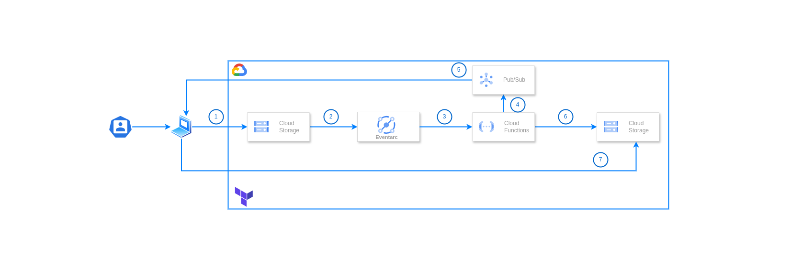

# Video Processing Pipeline

## Table of Contents
- [Video Processing Pipeline](#video-processing-pipeline)
  - [Table of Contents](#table-of-contents)
  - [Description](#description)
  - [Requirements](#requirements)
  - [Architecture Overview](#architecture-overview)
  - [Setup](#setup)
    - [Clone the Repository](#clone-the-repository)
    - [Create Google Cloud Storage Bucket](#create-google-cloud-storage-bucket)
    - [Configure Terraform to Use the Bucket](#configure-terraform-to-use-the-bucket)
  - [Known issues](#known-issues)

## Description
This project implements a video processing pipeline using Google Cloud services.

## Requirements
- Google Cloud Platform account
- Gcloud CLI authenticated
- Terraform for infrastructure provisioning
- All the required APIs have been enabled. Check the guide here: [API guide](./docs/apiguide.md)
  
## Architecture Overview

[](https://www.terraform.io/)
[](https://cloud.google.com/)
[](https://www.ffmpeg.org/)


The architecture of the video processing pipeline is as follows:

1. **User Uploads Video**: The user uploads a video to Cloud Storage.
2. **Object Finalized Event**: An "Object finalized" event is triggered when the video is uploaded to Cloud Storage.
3. **Cloud Function**: A Cloud Function is initialized to process the uploaded video.
4. **Publisher Event**: A publisher event is invoked when the video is processed.
5. **Subscriber Notification**: The web app receives a subscriber notification.
6. **Processed Video Storage**: The processed video is sent to Cloud Storage.
7. **Web App Receives Video**: The web app receives the processed video.

The user uploads the video to cloud storage. An Object finalized event is triggered. A Cloud function is initialized to process the Video. A publisher event is invoked when the image is processed. The web app receives a subscriber notification. The processed Video is sent to clous storage. The web app receives the processed video.

## Setup

### Clone the Repository

Before you can begin, you'll need to clone the repository containing the video processing pipeline code. Run the following command in your terminal:

```
git clone https://github.com/markbosire/GCP-HLS-Processing-Pipeline.git
```

### Create Google Cloud Storage Bucket

Before you can use Terraform to manage your infrastructure, you'll need to create a Google Cloud Storage bucket to store the Terraform state file. You can do this using the Google Cloud SDK (gcloud) command-line tool.

 Install the Google Cloud SDK if you haven't already. You can find instructions for your operating system on the [Google Cloud SDK installation guide](https://cloud.google.com/sdk/docs/install).

Open a terminal and run the following command to create a new Google Cloud Storage bucket:

```
gcloud storage buckets create gs://my-terraform-state-bucket --location=us-east4
```

Replace `my-terraform-state-bucket` with a unique name for your bucket. The `--location=us-east4` parameter specifies the location for the bucket, which should be in the same region as your other Google Cloud resources.

### Configure Terraform to Use the Bucket

Now that you have a Google Cloud Storage bucket, you can configure Terraform to use it to store the state file.

 In your Terraform configuration, add the following block to specify the backend configuration in `backend.tf`:

```hcl
terraform {
  backend "gcs" {
    bucket = "banded-meridian-435911-g6-terraform" # GCS bucket name to store terraform tfstate change this
    prefix = "function"                            # Prefix name should be unique for each Terraform project having same remote state bucket.
  }
  # backend "local" {}

}
```

1. Set the default values for the Terraform variables in the `variables.tf` file:

```hcl
variable "project_id" {
  type    = string
  default = "banded-meridian-435911-g6" #change the project-id
}

variable "region" {
  type    = string
  default = "us-east4" #change the region
}
```

2. Run the Terraform commands to provision the infrastructure:

```bash
terraform init
terraform fmt
terraform validate
terraform apply -auto-approve
```
If you face a problem with the EventArc API during the deployment, please check out the [known issues section](#known-issues).

3. Deploy the Cloud Function to the provisioned infrastructure.

For the web apps setup, please refer to:

- [Web App Setup](./docs/webappsetup.md)

## Known issues

You might face errors related to Eventarc, for example:

```
Error: Error creating function: googleapi: Error 400: Validation failed for trigger projects/obj-localization/locations/us-central1/triggers/object-localization-109804: Invalid resource state for "": Permission denied while using the Eventarc Service Agent. If you recently started to use Eventarc, it may take a few minutes before all necessary permissions are propagated to the Service Agent. Otherwise, verify that it has Eventarc Service Agent role.

If you recently started to use Eventarc, it may take a few minutes before all necessary permissions are propagated to the Service Agent. Otherwise, verify that it has Eventarc Service Agent role.
```

It happens because the Eventarc permissions take some time to propagate. Wait some minutes and do the terraform apply command again. Please see the [Known issues for Eventarc](https://cloud.google.com/eventarc/docs/issues).

If you face any API issues check if all the required APIs have been enabled. Check the guide here: [API guide](./docs/apiguide.md)